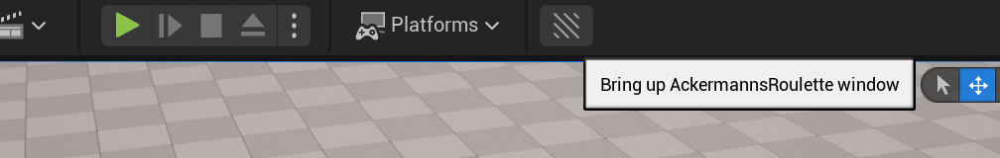
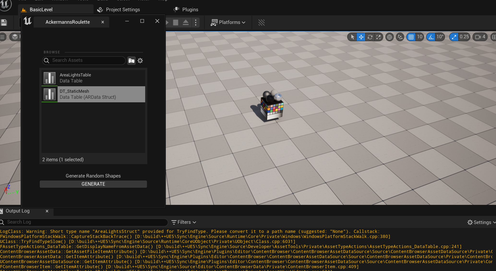

# EmperiaTest

Prerequisites:

* Unrel Engine 5.1
* VS2019

Please follow the steps below to run this project:

* Clone project to your local directory: "git clone https://github.com/ofhasirci/EmperiaTest.git"
* Right click to .uproject file and select "Generate Visual Studio project files"
* Build and open the project through:
    * Visual Studio: open .sln file and build project and start project OR
    * Click .uproject file and Click "Yes" button of Popup window
* When project opened, you have to create a Data Table for "Ackermann's Roulette" plugin or Data Table ("DT_StaticMesh") can be used for test.
* Creating the Data Table as follows:
    * Right click on editor select Miscellaneous/Data Table.
    * Select "ARDataStruct" on "Pick Row Structure" window and select OK
    * In created Data Table add rows and select Static Meshes.
* Click the Tool Bar button for Ackermann's Roulette Plugin

* When Plugin window is appeared select created Data Table which consists list of static meshes and click "Generate" button. You will see the meshes going to be spawn on the map.

